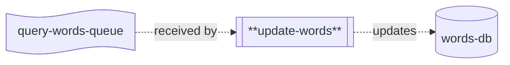

# update-words

## Description

This repo contains the source code for the `update-words` lambda, which is part of the Word List application's backend processing chain for updating word scores.



The `update-words` lambda receives a batch of messages containing information about words to be updated, including the new scores.  Batch requests are created to update the words database with the new information.

## Environment Variables

The lambda uses the following environment variables:

| Variable Name        | Description                                        |
|----------------------|----------------------------------------------------|
| DB_CONNECTION_STRING | Connection string used to connect to the words db. |

## Common Packages

This project uses the `WordList.Common` shared library (in the `lib-common` repository) and the `WordList.Data.Sql` library (in the `lib-sql` repository) both of which are published on GitHub.  To be able to import them, you'll need to use the following command:

```
dotnet nuget add source --username <your-username> --password <github-PAT> --store-password-in-clear-text --name github "https://nuget.pkg.github.com/word-list/index.json"
```